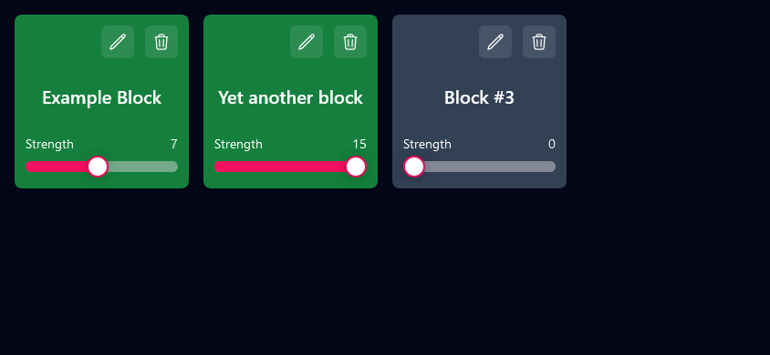

# Webstone Web UI
You're on the `webui` branch of Webstone, which contains the official Web UI for Webstone.



[Live instance](https://webstone.festival.tf)

## Usage
When opening the Web UI, you'll be greeted with two input fields and a big "Connect to Minecraft" button.  
The first input is the IP or hostname of your your Minecraft server. if you're playing singleplayer, you can leave it empty and the default `127.0.0.1` is used instead.  
The second input is the port the Webstone socket server is listening on, which is by default 4321.

Once connected, you'll see a grid of all registered Webstone blocks, which you can toggle on or off, rename or delete. You can also change the output signal strength for each Webstone block individually.

## For developers
To run this, you'll need Node.js or Bun (recommended). Then run one of the following commands, depending on your runtime:

```bash
npm install # Node.js

bun install # Bun
```

Then, run the development server:

```bash
npm run dev # Node.js

bun dev # Bun
```

Open [http://localhost:5173](http://localhost:5173) with your browser to start using the Web UI.

For API reference, please see [the main project description](https://github.com/festivaldev/webstone/tree/dev?tab=readme-ov-file#api-reference)