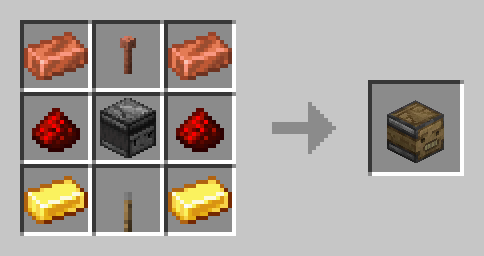

<p align="center">
    
</p>

<h1 align="center">Webstone  <br>
	<a href="https://modrinth.com/mod/webstone/versions#all-versions">
        
    </a>
	<a href="https://github.com/https://github.com/festivaldev/webstone/blob/forge-1.20.1/LICENSE">
        
    </a>
	<a href="https://www.curseforge.com/minecraft/mc-mods/webstone">
        
    </a>
    <a href="https://modrinth.com/mod/webstone">
        
    </a>
    <br><br>
</h1>

Remote control your Redstone contraptions using WebSockets.

## Background
This mod is inspired by a [YouTube video](https://www.youtube.com/watch?v=99Hd5Lh69T4) by Fundy, in which he briefly shows a custom Redstone block that can be controlled via a browser. This part of the video never got released as a standalone mod, so this is where Webstone comes in.

## Usage
The mod opens up a [WebSocket](https://developer.mozilla.org/en-US/docs/Web/API/WebSockets_API) server on port 4321, which then lets you connect with any WebSocket client (like [this one](https://github.com/festivaldev/webstone/tree/webui) - or the hosted client at [http://webstone.festival.tf](http://webstone.festival.tf)) to toggle registered blocks or change their output signal strength.  
You can find the Webstone Remote Block under the "Redstone Blocks" tab in Creative Mode (no Survival recipe yet). To register it, right-click it with an empty hand (if successful, you'll see a message above your hotbar). To toggle it locally, right-click the block while sneaking.

### Crafting Recipe

Starting with Webstone 1.0.1, the Webstone Remote Block can be crafted outside of Creative:



## Configuration Options

Webstone has its own configuration file, located at `.minecraft/config/webstone-config.toml`. You can set the following options:

| Key | Default value | Description |
| --- | --- | --- |
| `Passphrase` | `""` | Passphrase to allow only authorized users. |
| `WebSocketPort` | `4321` | Port used by the Webstone WebSocket Server. |
| `SecureWebSocket` | `false` | Specifies if the WebSocket should use a secure connection. |
| `CertificateFilename` | `cert.pem` | Filename of the certificate public key inside `.minecraft/data`. |
| `CertificateKeyFilename` | `key.pem` | Filename of the certificate private key inside `.minecraft/data`. |
| `CertificateKeyPass` | `""` | Passphrase used for the private key. |

## API Reference

<details>
<summary>Server → Client</summary>

If the WebSocket server needs a passphrase to connect to, clients need to supply it encoded as a hex string in the `Sec-WebSocket-Protocol` header. Using JavaScript, you can add it to an array as a second parameter when creating a WebSocket instance, following the connection URL:

```js
const socket = new WebSocket('ws://<IP address or FQDN>:4321', ['<your passphrase>']);
```

When connecting to the WebSocket server, the connecting client receives a list of currently registered blocks (including their display name, the current powered state, the output signal strength and the assigned group's id, if any), as well as block groups.

```jsonc
{
    "type": "block_list",
    "data": [
        {
            "blockId": "00000000-0000-0000-0000-000000000000",
            "name": "Example",
            "power": 15,
            "powered": false,
            "groupId": "00000000-0000-0000-0000-000000000000"
        },
        // ...
    ]
}
```

```jsonc
{
    "type": "block_groups",
    "data": [
        {
            "groupId": "00000000-0000-0000-0000-000000000000",
            "name": "Example Group",
            "blockIds": [
                //...
            ]
        },
        // ...
    ]
}
```

If any block or group is updated, their data will broadcast to every connected client.

```jsonc
{
    "type": "block_updated",
    "data": {
        "blockId": "00000000-0000-0000-0000-000000000000",
        "name": "Example",
        "power": 15,
        "powered": false,
        "groupId": "00000000-0000-0000-0000-000000000000"
    }
}
```

```jsonc
{
    "type": "group_updated",
    "data": 
        "groupId": "00000000-0000-0000-0000-000000000000",
        "name": "Example Group",
        "blockIds": [
            //...
        ]
    }
}
```
</details>

<details>
<summary>Client → Server</summary>

### Block Management
#### Set a block's powered state:

```jsonc
{
    "type": "block_state",
    "data": {
        "blockId": "00000000-0000-0000-0000-000000000000",
        "powered": false // Can be either true or false
    }
}
```

#### Set a block's output signal strength:

```jsonc
{
    "type": "block_power",
    "data": {
        "blockId": "00000000-0000-0000-0000-000000000000",
        "power": 7 // Can be anything between 0 and 15
    }
}
```

#### Set the display name of a block:

```jsonc
{
    "type": "rename_block",
    "data": {
        "blockId": "00000000-0000-0000-0000-000000000000",
        "name": "My Example Block"
    }
}
```

#### Delete a block from the Web UI:

```jsonc
{
    "type": "unregister_block",
    "data": {
        "blockId": "00000000-0000-0000-0000-000000000000"
    }
}
```

#### Add or remove a block to/from a group:

```jsonc
{
    "type": "change_group",
    "data": {
        "blockId": "00000000-0000-0000-0000-000000000000",
        "groupId": "00000000-0000-0000-0000-000000000000"
    }
}
```

#### Move a block to a different position in a group:

This only affects a block if it has been assigned to a group.

```jsonc
{
    "type": "move_block",
    "data": {
        "blockId": "00000000-0000-0000-0000-000000000000",
        "newIndex": "2"
    }
}
```

### Group Management
#### Create a new group:

```jsonc
{
    "type": "create_group",
    "data": {
        "name": "My awesome group"
    }
}
```

#### Rename a group:

```jsonc
{
    "type": "create_group",
    "data": {
        "groupId": "00000000-0000-0000-0000-000000000000",
        "name": "My awesome (renamed) group"
    }
}
```

#### Delete a group:

```jsonc
{
    "type": "delete_group",
    "data": {
        "groupId": "00000000-0000-0000-0000-000000000000"
    }
}
```

#### Move a group to a new position in the list of all groups:

```jsonc
{
    "type": "move_group",
    "data": {
        "groupId": "00000000-0000-0000-0000-000000000000",
        "newIndex": 2
    }
}
```

</details>

## Security

In Webstone 1.0.2, two security options have been added: an optional passphrase required to connect to the WebSocket server, as well as support for Secure WebSockets using SSL certificates.

### Passphrase

In order to protect your server from unauthorized access, you can add an optional passphrase that clients need to submit before connecting to the WebSocket Server. This passphrase needs to be hashed using Bcrypt, so you don't have to store your passphrase in plain text.

To generate a Bcrypt hash, you can use `mkpasswd` on Debian-based systems (available in the `whois` package):

```
$ mkpasswd -m bcrypt <your password>
$2b$05$aHZ8W4AL3o.GnXN5ocSWXumD0Qlu0fU5jLGseYdLzbDW5N1d21Poa
```

The result then needs to be added to the configuration using the `Passphrase` key.

As described in the API Reference, connecting to the WebSocket server then needs the `Sec-WebSocket-Protocol` header to be set client-side to the hex-encoded passphrase in order for the connection to not be rejected.

### Secure WebSocket using TLS

By default, the traffic between the WebSocket server and clients is unencrypted. To encrypt the traffic, you'll need a domain name and a SSL certificate for that domain specifically, including the private and the public key. Both keys need to be stored in `.minecraft/data` as `cert.pem` (public key) and `key.pem` (private key) respectively. If the private key requires its own passphrase, you can set the `CertificateKeyPass` key in the config.

To enable or disable Secure WebSocket, set the `SecureWebSocket` key to either `true` or `false`.


## Support

Currently, only Forge is supported. Feel free to port this over to any other mod loader you like, as long as you clearly state this project as the original one.

The mod has been tested on Minecraft 1.20.1, but should also work on newer versions. It also may or may not work on older versions of Minecraft.

## Credits
Fundy - Original idea, textures (probably)  
Kaupenjoe - Creating a tutorial series that made this mod possible in the first place